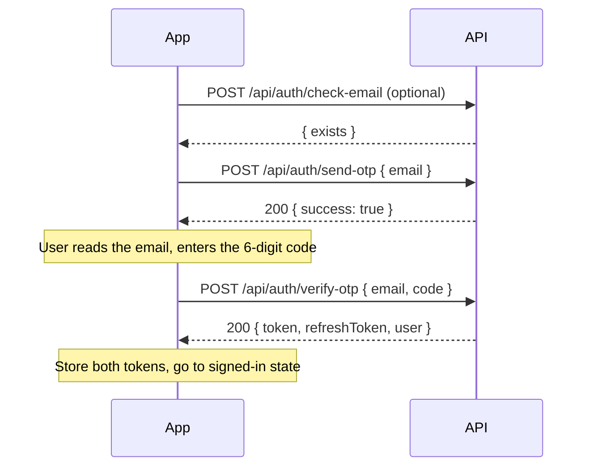
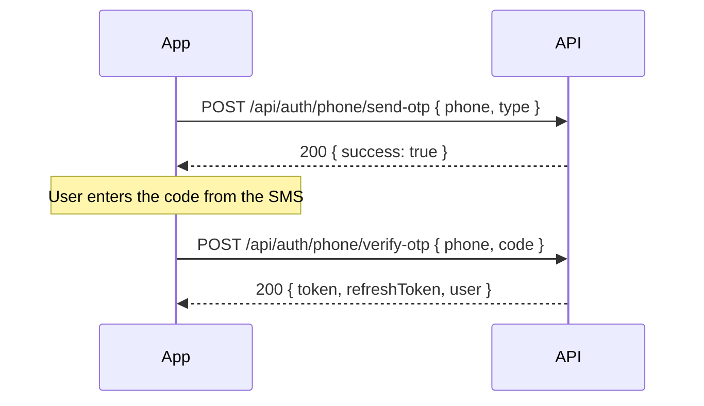
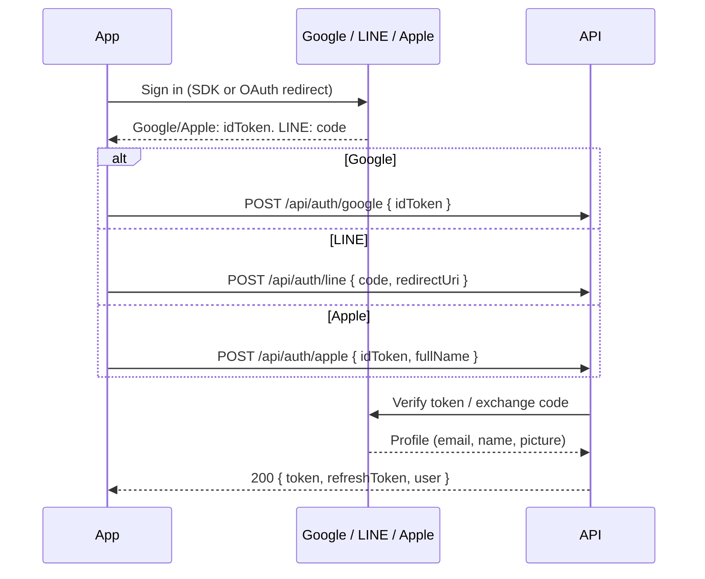
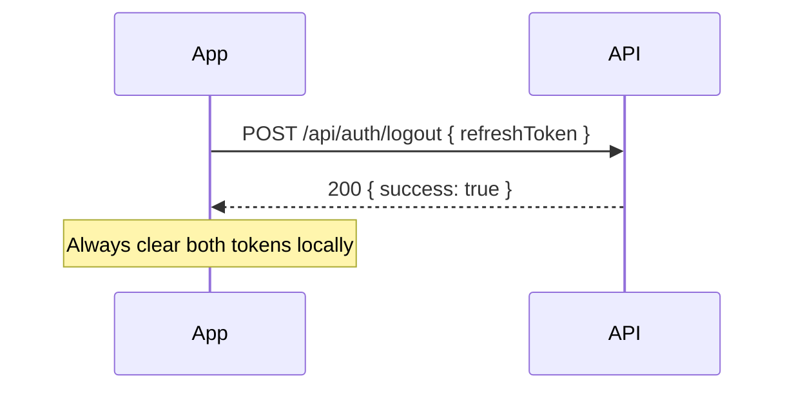
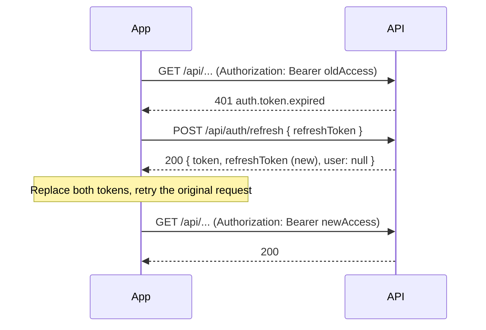

# 認證流程（Auth Flow）

涵蓋 Email OTP、手機 OTP、Google / LINE / Apple 登入、refresh、logout 與 401 處理。各端點的欄位、型別與錯誤範例請看 Swagger 的 **Auth** 區塊；本文只描述跨多支 API 的流程。全域慣例見 [conventions.md](conventions.md)。

所有 `/api/auth/**` 端點都是公開的（不帶 `Authorization`），並受限流保護（見 conventions §5）。

## 1. Token 與效期

| Token | 預設效期 | 設定 | 說明 |
|-------|----------|------|------|
| access token（`token`） | 1 小時 | `JWT_EXPIRATION_SECONDS`（預設 3600） | JWT，無狀態；以 `Authorization: Bearer <token>` 帶入受保護端點 |
| refresh token（`refreshToken`） | 30 天 | `JWT_REFRESH_EXPIRATION_DAYS`（預設 30） | 不透明字串（UUID），存在伺服器 Redis；**單次使用**，每次 refresh 都會換一組新的 |
| refresh grace window | 10 秒 | `JWT_REFRESH_GRACE_SECONDS`（預設 10） | 見 §6 |

存放建議：

- Web：access token 放記憶體；refresh token 目前由前端自行保存（API 不會設 cookie），請避免被第三方腳本讀取（嚴格 CSP、不載入不信任的腳本），並避免寫進 log。
- App：兩者都放系統安全儲存（Keychain / Keystore）。
- 每次 login 或 refresh 回應都要**同時覆寫**兩個 token；舊的 refresh token 之後不能再用。
- `user` 只在 login / signup 回應出現，refresh 回應的 `user` 是 `null`，請保留登入時的資料。

## 2. Email OTP 登入 / 註冊

同一組端點處理登入與註冊：伺服器依 email 是否已註冊決定，不需要前端指定。



| 步驟 | API | 備註 |
|------|-----|------|
| 1（選用） | `POST /api/auth/check-email` | 只用來決定文案是「登入」還是「註冊」 |
| 2 | `POST /api/auth/send-otp` | OTP 預設 180 秒有效；同一 email 重寄有冷卻（預設 180 秒） |
| 3 | `POST /api/auth/verify-otp` | 成功即消耗 OTP；新 email 會自動建帳號 |

## 3. 手機 OTP 登入 / 註冊



- `type` 省略等同 `login`，此時手機號必須已註冊，否則 400 `auth.phone.not_registered`。新號碼請送 `type: "signup"`。
- `verify-otp` 沒有 `type`：號碼不存在就建立帳號，存在就登入。

## 4. Google / LINE / Apple 登入

三者的共通點：前端先向 provider 取得憑證，再交給後端換 JWT。後端只信任 provider 已驗證的 email，未驗證會回 401 `auth.email_not_verified`（避免帳號被他人用未驗證 email 接管）。



| Provider | 送給後端的資料 | 注意 |
|----------|----------------|------|
| Google | `idToken` | audience 必須是本專案的 Google client ID |
| LINE | `code` + `redirectUri` | `redirectUri` 必須與授權時使用的相同；若 LINE 沒給 email，後端用 `line_<userId>@line.oauth` 代替，所以 `user.email` 不會是 `null` |
| Apple | `idToken` + `fullName` | Apple 只在**第一次授權**提供姓名，要在那次就送 `fullName`；Apple 金鑰端點故障時回 503，可重試 |

## 5. Logout



- 只撤銷傳入的那組 refresh token，其他裝置不受影響。
- 傳入未知或已撤銷的 token 也回 200，所以前端不用處理失敗，請無條件清除本機 token。
- access token 是無狀態的，logout 後在到期前技術上仍有效；前端必須丟棄它。

## 6. Refresh 與 rotation



Rotation 規則（`RefreshTokenService`）：

1. 每次 refresh 都會**消耗**傳入的 refresh token，回傳新的 access token 與新的 refresh token。
2. **Grace window（預設 10 秒）**：同一個舊 refresh token 在視窗內再次送來（例如兩個分頁或兩個請求同時 refresh），會拿到**完全相同的那組新 token**，不會失敗，也不會被當成攻擊。
3. **Reuse 偵測**：舊 token 已被消耗、又超出 grace window 才被送來（可能是 token 外洩），後端會**撤銷該使用者所有裝置的全部 refresh token**，並回 401 `auth.suspicious_login`。前端收到後必須清除本機 token、強制登出並導向登入頁，提示「為了安全已登出所有裝置，請重新登入」。
4. refresh 時會重新讀取使用者的最新 roles，角色異動在下次 refresh 後生效（最長一個 access token 效期）。
5. 使用者不存在或被停權時，refresh 回 401 `auth.refresh_token.invalid`，並撤銷該使用者所有 refresh token。

## 7. 401 處理策略

`errorCode` 決定動作（不要只看 status）：

| errorCode | 來源 | 動作 |
|-----------|------|------|
| `auth.token.expired` | 受保護端點 | refresh 一次，成功後重送原請求 |
| `auth.token.invalid` | 受保護端點 | 清除 token，導向登入頁 |
| `common.unauthorized` | 受保護端點（沒帶 token） | 清除 token，導向登入頁 |
| `auth.refresh_token.invalid` | `/api/auth/refresh` | refresh token 無效或過期，清除 token 並導向登入頁 |
| `auth.suspicious_login` | `/api/auth/refresh` | 同上，並顯示安全提示 |

**單一 in-flight refresh**：多個請求可能同時收到 `auth.token.expired`。前端必須只送出**一個** refresh，其他請求排隊等結果：

```ts
let refreshing: Promise<void> | null = null;

async function request(input, init) {
  let res = await fetch(input, withAuth(init));
  if (res.status === 401 && (await errorCode(res)) === "auth.token.expired") {
    refreshing ??= doRefresh().finally(() => (refreshing = null)); // one refresh for all
    await refreshing;                                              // queued requests wait here
    res = await fetch(input, withAuth(init));                      // retry once, never loop
  }
  return res;
}
```

- 重送只做**一次**；重送後仍 401 就登出。
- `doRefresh` 失敗（401 或網路錯誤以外的任何失敗）→ 清除 token、導向登入頁，所有排隊中的請求一併失敗。
- 即使多分頁同時 refresh，伺服器的 grace window 也會讓它們拿到同一組 token；但仍建議用 `BroadcastChannel` / storage event 同步，避免後到的分頁覆寫成較舊的 token。
- 不要對 `/api/auth/**` 的 401 再套用 refresh 邏輯（會造成無限迴圈）。

## 8. 停權使用者（`User.active=false`）

| 時機 | 回應 |
|------|------|
| 任何登入方式（OTP / Google / LINE / Apple） | 403 `auth.account_banned`，不發 token |
| refresh | 401 `auth.refresh_token.invalid`，且該使用者所有 refresh token 被撤銷 |
| 已持有、尚未過期的 access token | 不會被立即擋下，最長可再用到 access token 到期；到期後 refresh 失敗即登出 |

UI：登入時收到 `auth.account_banned` 顯示「此帳號已被停用」，不要重試。

## 9. 管理後台登入（`checkRole`）

`send-otp` 與 `verify-otp` 的 `checkRole: "true"`（字串）只給後台使用：

- 帳號必須**已存在且角色含 `admin`**，否則 403 `auth.admin.forbidden`。
- 檢查發生在寄送 / 消耗 OTP 之前，所以不會因此建立新帳號或燒掉 OTP。
- 一般使用者端不要送 `checkRole`（省略或 `"false"`）。
- 這只是登入入口的限制；`/api/admin/**` 仍由 JWT 的角色把關（非 admin 回 403 `common.forbidden`）。

## 10. 常見錯誤

| errorCode | HTTP | 何時發生 | 建議 UI |
|-----------|------|----------|---------|
| `auth.identifier.required` | 400 | email / phone 皆未提供 | 提示填寫 |
| `auth.otp.resend_cooldown` | 400 | 冷卻期內重寄；`message` 含剩餘秒數 | 倒數後才可重寄 |
| `auth.email.send_failed` / `auth.sms.send_failed` | 400 | 信件 / 簡訊寄送失敗 | 提示稍後重試 |
| `auth.phone.not_registered` | 400 | `type=login` 但號碼未註冊 | 導向註冊流程（`type=signup`） |
| `auth.otp.invalid_or_expired` | 401 | 沒有有效的 OTP（過期、已使用、從未寄送） | 引導重新寄送 |
| `auth.invalid_otp` | 401 | 驗證碼錯誤 | 提示重新輸入 |
| `auth.otp.too_many_attempts` | 401 | 連續錯 5 次，OTP 已作廢 | 要求重新寄送 |
| `auth.admin.forbidden` | 403 | `checkRole` 但不是 admin | 顯示無權限 |
| `auth.account_banned` | 403 | 帳號被停權 | 顯示帳號已停用 |
| `auth.email_not_verified` | 401 | OAuth provider 的 email 未驗證 | 提示改用其他登入方式 |
| `auth.google.*` / `auth.line.*` / `auth.apple.*` | 400 / 401 | provider 憑證無效或後端未設定 | 提示改用其他方式或稍後重試 |
| `common.service_unavailable` | 503 | Apple 金鑰端點故障 | 可重試（指數退避） |
| `auth.refresh_token.invalid` | 401 | refresh token 無效、過期或使用者被停權 | 清除 token，導向登入 |
| `auth.suspicious_login` | 401 | 偵測到 refresh token 重複使用，全部 session 已終止 | 清除 token，導向登入並顯示安全提示 |
| `common.rate_limited` | 429 | 超過限流 | 依 `Retry-After` 倒數 |
