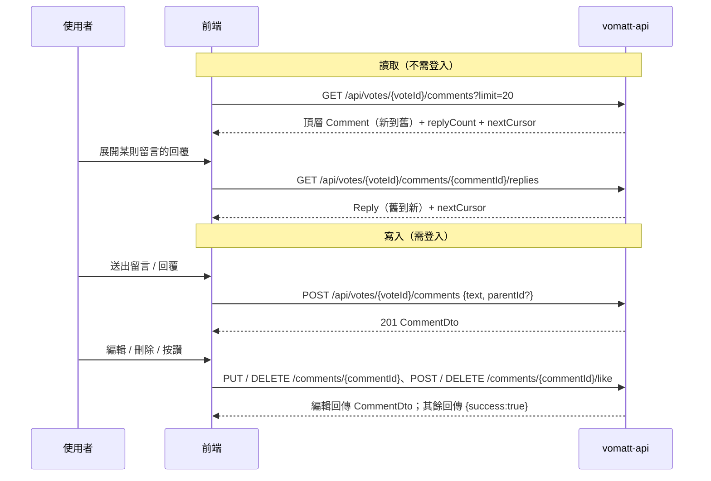

# 留言與回覆（Comment / Reply）

## 情境

使用者在 Poll 底下閱讀、發表、編輯、刪除留言，對留言按讚，並以「單層」回覆參與討論。未登入也能讀取。欄位細節見 Swagger 的 **Vote Comment** tag，這裡只講流程與狀態。

> 路徑中的 `votes` 即 Poll（見 [glossary.md](../glossary.md)）。

## 時序

## 呼叫順序

| 步驟 | API | 備註 |
|------|-----|------|
| 1 | `GET /api/votes/{voteId}/comments` | 公開。只回頂層 Comment；登入時帶 token 才會有正確的 `likedByCurrentUser` |
| 2 | `GET /api/votes/{voteId}/comments/{commentId}/replies` | 公開。使用者展開時才載入；`commentId` 必須是頂層 Comment |
| 3 | `POST /api/votes/{voteId}/comments` | 需登入。不帶 `parentId` = 頂層 Comment；帶 `parentId` = Reply |
| 4 | `PUT /api/votes/{voteId}/comments/{commentId}` | 只有作者；回傳更新後的 CommentDto |
| 5 | `DELETE /api/votes/{voteId}/comments/{commentId}` | 只有作者；軟刪除 |
| 6 | `POST` / `DELETE /api/votes/{voteId}/comments/{commentId}/like` | 按讚 / 取消讚；皆為冪等 |

分頁規則見 [conventions.md](../conventions.md#3-分頁cursor)：`nextCursor` 原樣帶回 `cursor`，`null` 即最後一頁。

## 狀態與 UI 對應

| 狀態 | 判斷 | UI | 隱藏 / 變動的欄位 |
|------|------|-----|------------------|
| 一般 Comment | `parentId == null`、`deleted == false` | 顯示作者、內文、讚數、「N 則回覆」 | — |
| Reply | `parentId != null` | 縮排一層；沒有「回覆數」 | `replyCount` 恆為 0 |
| 已編輯 | `edited == true` | 顯示「已編輯」，時間用 `createdAt`；編輯時間看 `updatedAt` | — |
| 已刪除、仍有回覆（placeholder） | `deleted == true` | 顯示「此留言已刪除」，保留「N 則回覆」入口 | `userId`、`author`、`text` 為 `null` |
| 已刪除、沒有回覆 | — | 列表中根本不會出現 | — |
| 未登入 | 沒帶 token | 可讀；按讚 / 回覆 / 發表導向登入 | `likedByCurrentUser` 恆為 `false` |

要點：

- **只有一層**：對 Reply 回覆時，`parentId` 傳 Reply 的 id 即可，伺服器會把新 Reply 掛到同一則頂層 Comment 下（回應的 `parentId` 是頂層 Comment）。前端想「回覆某人」可自行在 `text` 前綴 `@author`。
- **編輯 / 刪除 / 按讚都不檢查 Poll 狀態**，Ended 的 Poll 底下仍可留言。
- **刪除後樂觀更新**：頂層 Comment 若 `replyCount > 0`，改顯示 placeholder；否則直接移除。刪除 Reply 則從列表移除，並把頂層 Comment 的 `replyCount` 減 1。
- **按讚**可樂觀更新；重複按讚、重複取消都回成功，不必處理衝突。
- 已刪除的留言再編輯 / 刪除 / 按讚會得到 `comment.not_found`。

## 常見錯誤

| errorCode | HTTP | 何時發生 | 建議 UI |
|-----------|------|----------|---------|
| `common.validation_failed` | 400 | `text` 為空白或超過 2000 字 | 標示輸入欄位，保留草稿 |
| `comment.parent.invalid` | 400 | `parentId` 不存在、已刪除或不屬於這個 Poll | 提示「要回覆的留言已不存在」，重新整理列表 |
| `common.cursor_invalid` | 400 | `cursor` 不是伺服器回傳的值 | 丟掉 cursor，從第一頁重載 |
| `auth.token.expired` | 401 | access token 過期 | 走 [conventions.md](../conventions.md#2-http-status-與前端處理) 的 refresh 流程後重送 |
| `common.unauthorized` | 401 | 寫入端點沒帶 token | 導向登入 |
| `comment.forbidden` | 403 | 編輯 / 刪除別人的留言 | 隱藏他人留言的編輯 / 刪除按鈕；收到時 toast 提示 |
| `vote.not_found` | 404 | Poll 不存在 | 顯示找不到 Poll |
| `comment.not_found` | 404 | 留言不存在 / 已刪除，或 replies 的 `commentId` 不是這個 Poll 的頂層 Comment | 從列表移除該項並重新整理 |
| `user.not_found` | 404 | 登入的帳號已不存在 | 視為登入失效，清除登入狀態 |
| `common.rate_limited` | 429 | 觸發限流 | 依 `Retry-After` 倒數 |
