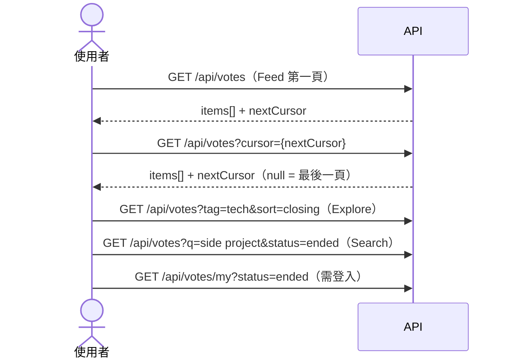

# 探索 Poll（Feed / Explore / Search / 我的 Poll）

欄位細節請看 Swagger（`GET /api/votes`、`GET /api/votes/my`）；分頁規則見 [conventions §3](../conventions.md)。

## 情境

使用者在首頁看最新的 Open Poll（Feed）、依標籤瀏覽（Explore）、用關鍵字找（Search），或查看自己建立 / 投過的 Poll。

## 時序

## 呼叫順序

| 畫面 | API | 排序 | 備註 |
|------|-----|------|------|
| Feed | `GET /api/votes` | Open，最近開始優先 | 預設等同 `status=open&sort=newest`；公開 |
| Explore（進行中） | `GET /api/votes?tag={slug}` | `sort=newest`（預設）或 `sort=closing`（最快結束優先） | `tag` 為標籤 slug，從 `GET /api/tags` 取得 |
| Explore（已結束） | `GET /api/votes?tag={slug}&status=ended` | 最近結束優先 | **不可帶 `sort`**，否則 400 `vote.list.sort_not_allowed` |
| Search | `GET /api/votes?q={text}` | 同 Explore | 比對標題與描述，**不比對選項文字**；至少 2 個字元；可與 `tag`、`status`、`sort` 合用 |
| 我的 Poll（進行中） | `GET /api/votes/my` | 最快結束優先 | 需登入。包含自己建立的 **Scheduled** 與 Open，以及自己有 Ballot 的 Open |
| 我的 Poll（已結束） | `GET /api/votes/my?status=ended` | 最近結束優先 | 含 Cancelled；每筆有 `unread`（Ended Notification 是否未讀） |

### 參數

| 參數 | 適用 | 說明 |
|------|------|------|
| `status` | 兩者 | `open`（預設）或 `ended`；其他值 400 `common.invalid_status` |
| `sort` | 僅 `GET /api/votes` 且 `status=open` | `newest`（預設）或 `closing`；其他值 400 `common.invalid_sort` |
| `tag` | 僅 `GET /api/votes` | 標籤 slug；空白視為不篩選 |
| `q` | 僅 `GET /api/votes` | 關鍵字（前後空白會去除）；空白視為不搜尋；少於 2 字元 400 `vote.search.query_too_short` |
| `cursor` | 兩者 | 上一頁的 `nextCursor`，原樣帶回；亂填 400 `common.cursor_invalid` |
| `limit` | 兩者 | 預設 20，夾在 1–50，不會報錯 |

### Cursor 分頁

- 第一頁不帶 `cursor`；之後帶上一頁回的 `nextCursor`；`nextCursor = null` 表示沒有下一頁。
- 改變任何篩選條件（`status`、`sort`、`tag`、`q`）就要丟掉舊 cursor 從頭開始。cursor 綁定排序鍵，跨排序混用會得到錯亂或 400 的結果。
- 不支援跳頁，也沒有總筆數。

## 狀態與 UI 對應

| 清單 | 會出現的 Poll 狀態 | 注意 |
|------|------------------|------|
| Feed / Explore / Search（`status=open`） | 只有 Open | **Scheduled 永遠不會出現**在公開清單 |
| Explore / Search（`status=ended`） | Ended（含自然結束與被 Close） | `options[].votes` 有值 |
| 我的 Poll（`open`） | Scheduled + Open | 用 `votingActive` 區分；Scheduled 的 `votingActive=false` |
| 我的 Poll（`ended`） | Ended + Cancelled | `unread=true` 顯示紅點，已讀請走通知流程（`POST /api/notifications/{voteId}/read`） |

- 清單項目與 `GET /api/votes/{voteId}` 是同一個 `VoteResponse`：Open 的 `options[].votes` 皆為 `null`（Sealed），只有 `participantCount`（Turnout）可用。
- 公開清單若帶 token，每筆的 `myOptionId` 會標示自己選了哪個選項，可直接畫出「已投票」狀態。
- `unread` 只在「我的 Poll → `status=ended`」有值，其他情況為 `null`。

## 常見錯誤

| errorCode | HTTP | 何時發生 | 建議 UI |
|-----------|------|---------|---------|
| `common.invalid_status` | 400 | `status` 不是 `open` / `ended` | 開發期錯誤，檢查參數 |
| `common.invalid_sort` | 400 | `sort` 不是 `newest` / `closing` | 同上 |
| `vote.list.sort_not_allowed` | 400 | `status=ended` 卻帶了 `sort` | 切到已結束分頁時移除 `sort` |
| `vote.search.query_too_short` | 400 | `q` 少於 2 字元 | 輸入少於 2 字時先不送出 |
| `common.cursor_invalid` | 400 | `cursor` 不是此端點發的 | 丟掉 cursor，從第一頁重載 |
| `common.unauthorized` / `auth.token.expired` | 401 | 呼叫 `/api/votes/my` 未登入或過期 | 見 [conventions §2](../conventions.md) |
