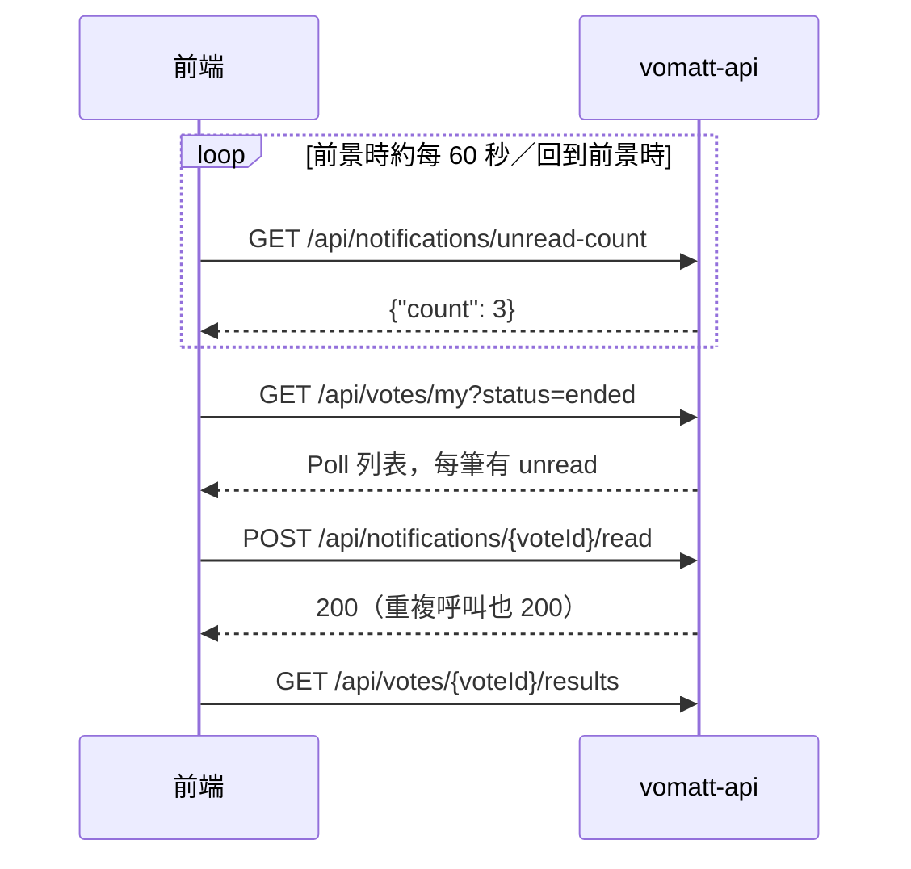

# 通知（Ended Notification）

## 情境
Poll 結束後，擁有者與 Participant 要被提醒「去看結果」。前端在導覽列顯示未讀紅點，使用者點進列表後逐筆標為已讀。欄位細節見 Swagger（tag `Notification`）。

## 時序

## 呼叫順序
| 步驟 | API | 備註 |
|------|-----|------|
| 1 | `GET /api/notifications/unread-count` | 紅點／徽章數字 |
| 2 | `GET /api/votes/my?status=ended` | **通知列表本身**。每筆 `VoteResponse.unread` 表示是否未讀；沒有獨立的 `GET /api/notifications` |
| 3 | `POST /api/notifications/{voteId}/read` | 使用者點開該 Poll 時呼叫；冪等 |
| 4 | `GET /api/votes/{voteId}/results` | 通知導向結果頁 |

## 狀態與 UI 對應
通知**不存在資料庫中**，而是讀取時依 Poll 狀態推算（ADR 0003），只儲存「已讀」紀錄。

| 情況 | 是否產生通知 |
|------|--------------|
| Poll 已 Ended（到期或擁有者提前 Close），你是擁有者 | 是 |
| Poll 已 Ended，你持有 Ballot（Participant） | 是 |
| Participant 在結束前做了 Retraction | 否 |
| Scheduled 時就被 Close（Cancelled） | 否（`unread` 一律為 `false`） |
| Poll 尚未 Ended | 否 |

- **未讀數** = 符合上述條件、且你尚未呼叫 `read` 的 Poll 數。到期的瞬間未讀數會自動 +1，不需任何事件。
- **沒有 push**：前端需自行輪詢。建議：登入後及 App／分頁回到前景時各查一次，前景時每 60 秒一次，背景分頁暫停；不需要輪詢列表，只輪詢 `unread-count`，使用者開啟通知頁時才取列表。
- 標為已讀後，`unread-count` 立即 -1，列表中該筆 `unread` 變 `false`；重複標記不會再扣。
- `unread` 只在 `status=ended` 的列表有值，`status=open`（預設）時為 `null`。

## 常見錯誤
| errorCode | 何時發生 | 建議 UI |
|-----------|----------|---------|
| `notification.not_found` | 該 Poll 尚未 Ended、是 Cancelled、不存在，或你既非擁有者也非 Participant | 忽略並重新整理列表 |
| `common.bad_request` | `voteId` 不是有效 id | 通用錯誤提示 |
| `auth.token.expired` / `auth.token.invalid` / `common.unauthorized` | 見 [conventions](../conventions.md) | 依慣例 refresh 或導向登入 |
