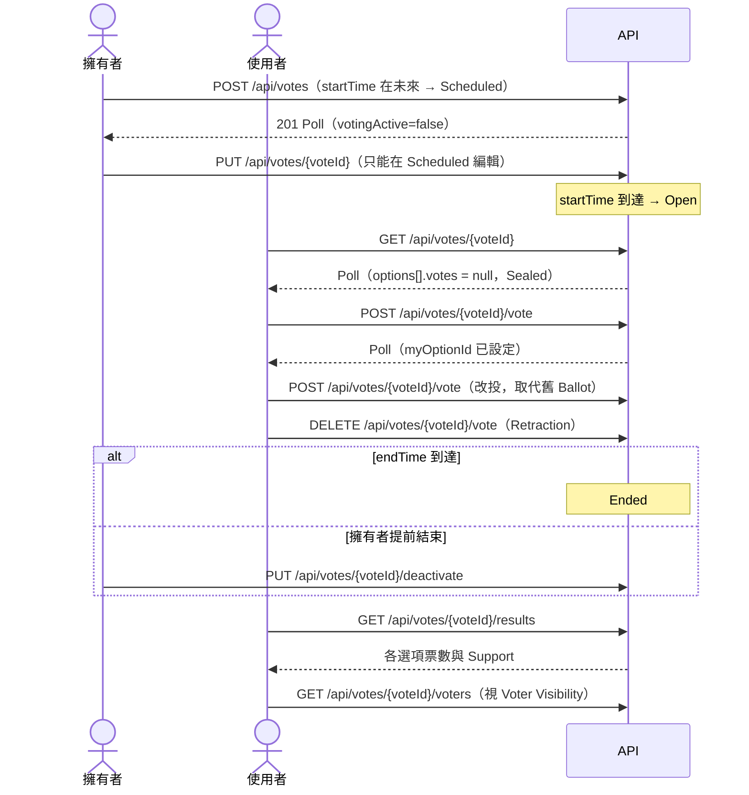

# Poll 生命週期

欄位細節請看 Swagger（tag `Vote`）；名詞對照見 [glossary](../glossary.md)，錯誤格式見 [conventions](../conventions.md)。

## 情境

擁有者建立 Poll、（選擇性）排程、開放後使用者投 Ballot / 改投 / 撤回，結束後所有人看結果。

## 時序

## 呼叫順序

| 步驟 | API | 備註 |
|------|-----|------|
| 1. 建立 | `POST /api/votes` | 回 **201**。不帶 `startTime`（或過去時間）→ 立即 Open；未來時間 → Scheduled。`endTime` 必填，最長為開始後 365 天；選項 2–10 個；`voterVisibility` 預設 `OWNER`，Open 後不可再改 |
| 2. 編輯（選） | `PUT /api/votes/{voteId}` | 僅擁有者、僅 Scheduled；body 與建立相同（整份重送）。**選項會整批重建，option ID 會變**；省略 `startTime` 則維持原開始時間 |
| 3. 取消（選） | `PUT /api/votes/{voteId}/deactivate` | Scheduled 時 Close = Cancelled（視為 Ended，`endTime` 早於 `startTime`，不發 Ended Notification） |
| 4. 瀏覽 | `GET /api/votes/{voteId}` | 公開；登入時多帶 `myOptionId`。Scheduled / Open / Ended 都讀得到 |
| 5. 查自己是否已投 | `GET /api/votes/{voteId}/my-vote-status` | 或直接看 Poll 的 `myOptionId`（少一次呼叫） |
| 6. 投票 / 改投 | `POST /api/votes/{voteId}/vote` | body `{"optionIds":["…"]}`，**只能一個 ID**。已有 Ballot 時直接取代；選同一個選項不變。僅 Open 可用 |
| 7. 撤回 | `DELETE /api/votes/{voteId}/vote` | 整張 Ballot 撤回，冪等（沒有 Ballot 也回 200）。僅 Open 可用。`DELETE …/vote/{optionId}` 為相容舊版，請用前者 |
| 8. 提前結束（選） | `PUT /api/votes/{voteId}/deactivate` | 僅擁有者；Open → 立即 Ended；已 Ended 不變。回應只有 `SimpleResultResponse`，需重新 `GET` Poll 取得新狀態 |
| 9. 看結果 | `GET /api/votes/{voteId}/results` | 公開，僅 Ended；之前回 403 `vote.results.sealed`。`percentage` 是 Support（0–100，未四捨五入） |
| 10. 看誰投了什麼 | `GET /api/votes/{voteId}/voters?cursor=&limit=` | 需登入且 Poll 已 Ended，再依 Voter Visibility 決定；cursor 分頁，最舊的 Ballot 在前 |

## 狀態與 UI 對應

Poll 沒有 `status` 欄位，狀態由時間與 `votingActive` 推得：

| 狀態 | 判斷 | 可做的操作 | 不可見 / 為 null 的欄位 |
|------|------|-----------|-------------------------|
| **Scheduled** | `now < startTime` | 擁有者：編輯、Close（取消）。其他人：只能瀏覽、留言之外無操作 | `options[].votes = null`；`votingActive=false`；無法投票 |
| **Open** | `votingActive=true` | 投票、改投、撤回；擁有者可 Close | `options[].votes = null`（**Sealed**，連擁有者都看不到）；`/results`、`/voters` 回 403。**只有 `participantCount`（Turnout）看得到** |
| **Ended** | `now >= endTime`（自然結束或被 Close，兩者不區分） | 看 `/results`、`/voters`（視 Voter Visibility）；Ballot 凍結 | `options[].votes` 有值 |
| **Cancelled** | 屬於 Ended，且 `endTime <= startTime` | 無；從未接受過 Ballot，不發 Ended Notification | 同 Ended，但沒有任何 Ballot |

- `active=false` 只表示「擁有者提前 Close 過」；自然結束時 `active` 仍是 `true`。判斷狀態請用 `startTime` / `endTime` / `votingActive`，不要用 `active`。
- `myOptionId`：未登入、沒有 Ballot、或剛建立的 Poll（建立回應）為 `null`。
- `unread`：只有「我的 Poll → `status=ended`」會有值，其他端點都是 `null`（見 [discovery](discovery.md)）。
- 前端在 Scheduled 倒數、Open 倒數結束時，請重新 `GET /api/votes/{voteId}`，不要自行假設狀態已切換。

### Voter Visibility（`/voters` 誰能看）

| `voterVisibility` | 擁有者 | 其他登入者 | 未登入 |
|-------------------|--------|-----------|--------|
| `NOBODY` | 403 `vote.voters.hidden` | 403 `vote.voters.hidden` | 401 |
| `OWNER`（預設） | 可 | 403 `vote.voters.hidden` | 401 |
| `SIGNED_IN` | 可 | 可 | 401 |

Poll 尚未 Ended 時，不論哪個層級一律 403 `vote.results.sealed`。Participant 在投票前就能從 Poll 的 `voterVisibility` 得知這個層級，請在投票前顯示給使用者。

### Ballot 取代與 Retraction

- 改投就是再打一次 `POST …/vote`，伺服器在同一交易內取代舊 Ballot；Turnout 不會增加。回應的 `votedAt`（見 `/voters`）是目前這張 Ballot 的投票時間。
- Retraction 後使用者不再是 Participant，Turnout -1，也不會收到 Ended Notification。
- Poll Ended 後 Ballot 凍結：投票、改投、撤回都回 400 `vote.ended`。

## 常見錯誤

| errorCode | HTTP | 何時發生 | 建議 UI |
|-----------|------|---------|---------|
| `vote.not_found` | 404 | Poll 不存在 | 顯示找不到 |
| `vote.not_allowed` | 400 | 對 Scheduled Poll 投票 / 撤回 | 按鈕停用，顯示開始時間 |
| `vote.ended` | 400 | 對 Ended Poll 投票 / 改投 / 撤回 | 重新載入 Poll，切到結果畫面 |
| `vote.option.not_found` | 404 | 選項 ID 不存在（例如編輯 Scheduled Poll 後 ID 已變） | 重新載入 Poll |
| `vote.option.not_in_vote` | 400 | 選項屬於別的 Poll | 重新載入 Poll |
| `vote.multiple.not_allowed` | 400 | `optionIds` 超過一個，或建立時 `allowMultipleChoices=true` | 前端限制單選 |
| `vote.not_editable` | 400 | 編輯的 Poll 已 Open 或 Ended | 隱藏編輯入口 |
| `vote.forbidden` | 403 | 非擁有者編輯 / Close | 隱藏編輯 / Close 入口 |
| `vote.results.sealed` | 403 | Poll 未 Ended 就查 `/results`、`/voters` | 只顯示 Turnout |
| `vote.voters.hidden` | 403 | Voter Visibility 不允許目前使用者 | 不顯示投票者清單 |
| `vote.options.min` / `vote.options.max` | 400 | 選項少於 2 或多於 10 | 表單提示 |
| `vote.end_time.past` | 400 | `endTime` 已過 | 表單提示 |
| `vote.end_time.before_start` | 400 | `endTime` 不晚於 `startTime` | 表單提示 |
| `vote.duration.exceeded` | 400 | 開始到結束超過 365 天 | 表單提示 |
| `tag.ids.invalid` | 400 | `tagIds` 有不存在的標籤 | 重新載入標籤清單 |
| `common.validation_failed` | 400 | 欄位長度 / 必填（只回第一個欄位錯誤） | 標紅該欄位 |
