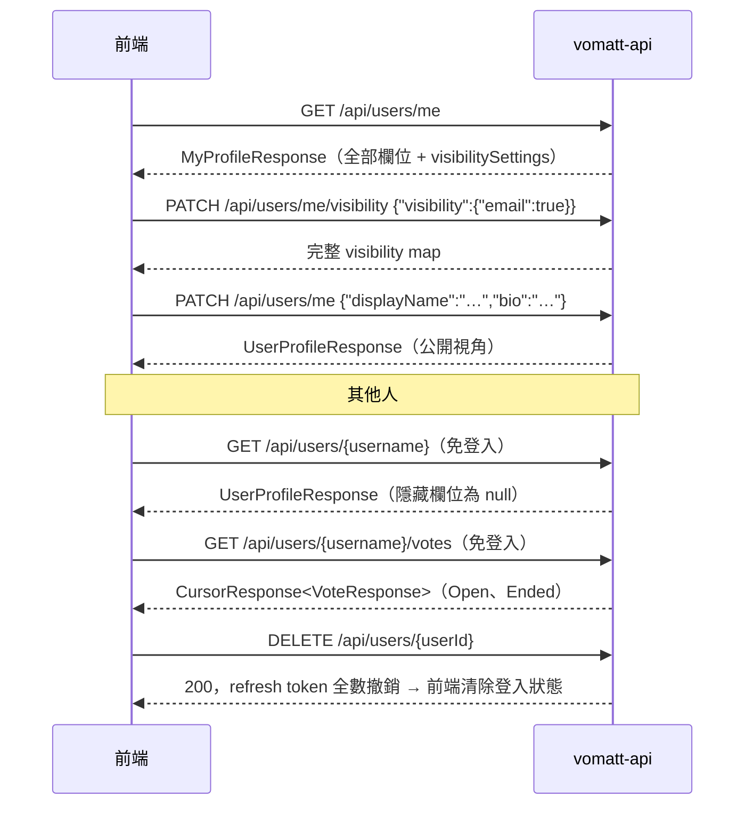

# 個人資料與公開頁

## 情境
使用者查看／編輯自己的資料、決定哪些欄位對外公開，別人則透過 username 查看公開頁、該使用者建立的 Poll 或搜尋使用者；使用者也可刪除自己的帳號。欄位細節見 Swagger（tag `User`）。

## 時序

## 呼叫順序
| 步驟 | API | 備註 |
|------|-----|------|
| 1 | `GET /api/users/me` | 自己的資料；**不受可見度影響**，欄位全給。`visibilitySettings` 是「別人看到什麼」 |
| 2 | `PATCH /api/users/me/visibility` | 只送要改的欄位；未送的保持原狀，未知 key 被忽略；回傳完整設定 |
| 3 | `PATCH /api/users/me` | 只改 `displayName` / `bio`；省略或 `null` = 不變（要清空請送空字串）。回傳的是公開視角 |
| 4 | `GET /api/users/{username}` | 公開、免登入，登入與否回應相同 |
| 4a | `GET /api/users/{username}/votes` | 公開、免登入；該使用者建立且**已開放**的 Poll（Open、Ended），最近開放的在前，cursor 分頁。不含 Scheduled 與開放前就取消的。登入時會帶上自己對各 Poll 的投票狀態 |
| 5 | `GET /api/users/search?username=` | 需登入；部分比對、不分大小寫、依 username 排序，cursor 分頁（見 [conventions](../conventions.md)）；不會列出停權使用者 |
| 6 | `DELETE /api/users/{userId}` | 本人或 admin；成功後該帳號所有 refresh token 失效 |

## 狀態與 UI 對應
可見度設定可控制的欄位：`email`、`firstName`、`lastName`、`location`、`points`、`membershipLevel`（預設**隱藏**），以及 `displayName`、`bio`（預設**公開**）。

| 欄位（公開頁 `UserProfileResponse`） | 何時為 `null` | UI |
|------|------|-----|
| `email`、`firstName`、`lastName`、`location`、`points`、`membershipLevel` | 擁有者未公開（預設），或本身沒有值 | 整列不顯示，不要顯示「已隱藏」以外的推測 |
| `displayName`、`bio` | 擁有者關閉公開，或使用者從未設定（預設公開） | `displayName` 為 `null` 時以 `username` 作為顯示名稱 |
| `username`、`joinedAt`、`totalPolls`、`totalVotes` | 永遠有值 | — |

注意事項：
- 停權使用者（`active=false`）對外不存在：公開頁與 Poll 列表都回 404 `user.not_found`，搜尋也不會列出。
- `totalPolls` 只算**已開放**的 Poll（Open、Ended），與 `GET /api/users/{username}/votes` 的筆數一致。`GET /api/users/me` 的 `totalPolls` 算法相同。
- `GET /api/users/search` 的 `UserDto` **不套用**可見度設定（含 `email`、`phoneNumber`、`active`、`lastLoginAt`）。前端請只顯示 `username` 等必要欄位，不要把它當作公開資料來源；需要公開資料請改打 `GET /api/users/{username}`。
- `totalVotes` 是「持有 Ballot 的 Poll 數」，非投票次數。
- 刪除帳號不可復原；成功後前端應清除本地 token 並導回登入頁。

## 常見錯誤
| errorCode | 何時發生 | 建議 UI |
|-----------|----------|---------|
| `user.not_found` | username / userId 不存在、該使用者已停權（公開頁、Poll 列表），或自己的帳號已不存在 | 顯示找不到使用者；若是 `/me` 則視為登出 |
| `user.delete.forbidden` | 刪除他人帳號且不是 admin | 顯示無權限（不要登出） |
| `common.missing_param` | 搜尋的 `username` 缺少或為空白 | 搜尋框為空時不送請求 |
| `common.cursor_invalid` | Poll 列表的 `cursor` 不是這支 API 發出的 | 從第一頁重新載入 |
| `common.validation_failed` | `displayName` 超過 100 字、`bio` 超過 500 字、`visibility` 缺少 | 在欄位旁顯示字數限制 |
| `common.bad_request` | `userId` 格式不是有效 id（僅 admin 會走到） | 通用錯誤提示 |
| `auth.token.expired` / `auth.token.invalid` / `common.unauthorized` | 見 [conventions](../conventions.md) | 依慣例 refresh 或導向登入 |
